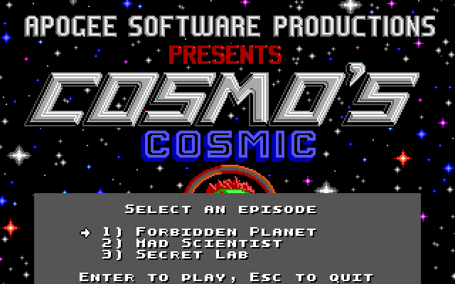

# Cosmo's Cosmic Adventure — native port for macOS, Linux and Windows

A source port of **Cosmo's Cosmic Adventure: Forbidden Planet** (Apogee
Software, 1992) that runs natively on modern machines. No DOSBox, no emulator,
no virtual machine — the original game's own code, compiled for your computer.

[](https://github.com/digows/cosmos/actions/workflows/ci.yml)
[](LICENSE)


|  |  |
|:-:|:-:|
|  |  |
|  |  |

Every screenshot is produced by this port, on macOS, from the original 1992 data
files — not captured from an emulator.

## What this is

The starting point is the game's own code rather than a reimplementation. This
project builds on [Cosmore](https://github.com/smitelli/cosmore), Scott
Smitelli's reconstruction of the v1.20 source recovered by disassembling the
1992 executables and accurate to 96.3% of their bytes, and replaces only the
layer that talked to PC hardware.

Everything above that layer is the game as Todd Replogle wrote it: the physics,
the actors, the collision handling, the bugs. What was written from scratch is
the machine underneath — an emulated EGA adapter, the programmable interval
timer, the keyboard controller, the PC speaker, and an AdLib.

If you want the story of what broke along the way, that is in
**[docs/porting-notes.md](docs/porting-notes.md)**.

## Status

| Subsystem | State |
|---|---|
| All three episodes, behind an in-game-style launcher | ✅ |
| Emulated EGA — write modes, latches, bit mask, map mask, set/reset | ✅ unit tested |
| Planar decode, palette, SDL3 presentation | ✅ unit tested |
| Interrupt and timing layer — int 8 / int 9, PIT, PIC | ✅ 140 Hz, measured |
| Map loading, scrolling, actors, the attract-mode demo | ✅ |
| Keyboard, including jump while moving | ✅ verified by script |
| Saving and restoring a game | ✅ |
| PC speaker sound effects | ✅ verified against the game's own sound data |
| AdLib (OPL2) music, via [ymfm](https://github.com/aaronsgiles/ymfm) | ✅ |
| macOS, Linux and Windows builds | ✅ green in CI |
| Joystick | ⬜ not implemented |
| Frame-by-frame comparison against DOSBox | ⬜ the largest remaining gap |

The game runs end to end: `cosmo` starts the original `InnerMain()` on its own
thread, the main thread plays the part of the PC hardware, and it goes through
its title screen, credits and playable attract-mode demo at the 10.8 frames per
second the original was paced for.

## Building

Requires CMake 3.21+, a C11 and C++17 compiler, and SDL3. If SDL3 is not
installed, CMake downloads and builds it. The only C++ in the project is the
wrapper around ymfm, which synthesises the AdLib's YM3812.

```bash
git clone --recurse-submodules https://github.com/digows/cosmos.git
cd cosmos
cmake --preset default
cmake --build --preset default
ctest --preset default
```

**macOS** — `brew install cmake sdl3`. This is where the port is developed and
played.

**Linux** — SDL3 from your distribution, or let CMake fetch it. The build
dependencies are listed in [the CI workflow](.github/workflows/ci.yml).

**Windows** — MinGW, either natively through MSYS2 or cross-compiled with
[the toolchain file](cmake/toolchain-mingw64.cmake). MSVC is not yet exercised.

A universal macOS binary, which builds SDL from source for both slices since the
Homebrew package is single-architecture:

```bash
cmake --preset macos-universal && cmake --build --preset macos-universal
```

### Checking other platforms without spending CI

Two container recipes reproduce the Linux and Windows jobs on any machine with
Docker, which is faster and cheaper than finding out from a red pipeline:

```bash
docker build -f tools/checks/linux.Dockerfile .
docker build -f tools/checks/windows-mingw.Dockerfile .
```

The first uses the same distribution and package list as the CI job. The second
cross-compiles with MinGW-w64, the same compiler family the Windows job uses.
Both have caught real defects before they reached a runner.

## Game data

The assets belong to Apogee Software and are **not** in this repository.

Put `COSMO1.STN` and `COSMO1.VOL` in the directory you run the game from, and
the episode 2 and 3 files beside them if you have those. Episode 1 is shareware
and freely available; see [gamedata/README.md](gamedata/README.md) for where to
get it, with checksums.

If a `COSMOn.CFG` is already present it wins over this port's defaults,
including the jump key — the original distributions shipped one with ctrl.
Delete it to get the defaults, or rebind in game.

## Running

```bash
cd gamedata && ../build/default/cosmo
```

Leave it alone for a minute and it plays its attract-mode demo.

`cosmo` is a launcher. It finds which episodes have their data present and runs
one, asking only when there is more than one to choose from — and when it asks,
it asks in the game's own font on the game's own title art, drawn through the
same emulated EGA. Name an episode to skip the menu:

```bash
cd gamedata && ../build/default/cosmo 2
```

The three episodes are separate programs — `cosmo1`, `cosmo2`, `cosmo3` — which
is not a packaging choice. They differ by preprocessor conditionals that include
or exclude whole actor implementations, so they compile to genuinely different
code. Apogee shipped three executables for the same reason.

`imgview` is a harness for the video layer alone, useful for inspecting the
fullscreen images without starting the game:

```bash
./build/default/imgview                                  # browse them
./build/default/imgview gamedata TITLE1.MNI shot.png 2   # headless screenshot
```

## Controls

Arrow keys move, **Space** jumps, **Alt** throws a bomb.

The original shipped ctrl for jump, which was ordinary in 1992; space has been
the platformer convention for a long time since, and it is the binding no window
manager fights over. That is the one deliberate change this port makes to the
game's behaviour — see [patches/0007](patches/). Bomb is unchanged.

All six can be rebound from the game's own menu: **G** for Game Redefine at the
main menu, then **K** for Keyboard redefine. The choice is written to
`COSMOn.CFG` alongside the sound settings and high scores, so it survives
between runs — but only on a clean exit. Quit through the game (**Q**, then
**Y**) rather than closing the window, exactly as on DOS, where killing the
program lost the file the same way.

On macOS, Command reports as Control. That matters if you rebind jump back to
ctrl: macOS binds Control with every arrow key to Mission Control, so ctrl and a
direction never reaches the application at all. Command is not claimed, and
fills that gap.

## How it works

The main thread plays the part of the PC hardware and a second thread plays the
part of the CPU. Cosmo's main loop never yields: it busy-waits on a counter its
own timer interrupt increments, and reads keyboard state its own keyboard
interrupt fills in. On real hardware those handlers fired underneath the running
program, so here the main thread fires them at whatever rate the game programmed
into the PIT — 140 Hz, or 560 with music — while the game runs alongside.

The original programs the EGA through I/O ports and writes into video memory at
segment 0xA000. Rather than rewriting the drawing code, this port emulates the
adapter: four 64 KiB planes in ordinary memory, with the write modes, latches,
bit mask and set/reset logic the game depends on.

That fidelity matters. `DrawSolidTile` blits scenery from video memory to video
memory using `*dst = *src` under write mode 1, where the CPU data is discarded
and what reaches the screen is the latch content the read loaded. An EGA that
looks correct but skips the latches renders garbage.

Assembly is avoided entirely. Upstream publishes a pure C implementation of
every drawing routine in `C-DRAWING.md`, written as a curiosity because it is
too slow for a 286. On a modern CPU that cost is irrelevant, and using it removes
the dependency on Turbo Assembler, which Borland never released for free.

## Debugging and automated checks

`COSMO_SCRIPT` points at a file of timed key events, which drives the game
without anyone at the keyboard. Each line is
`<milliseconds> <down|up|tap> <key>`; see [tests/scripts](tests/scripts/).

| Variable | Effect |
|---|---|
| `COSMO_DEBUG=1` | Timer rate, interrupt delivery, and the game's own key and command state, once a second |
| `COSMO_SHOT_PATH=p COSMO_SHOT_MS=500,3000` | Screenshots at fixed moments after startup. `F12` takes one at any time |
| `COSMO_AUDIO_WAV=out.wav` | Records everything the sound hardware produces. The header stays valid even if the game is killed rather than quit |
| `COSMO_OPL_LOG=1` | Traces every write to the AdLib's registers |
| `COSMO_SCRIPT=file` | Replays timed key events |

Between them these are how the sound effects were checked against the game's own
data, and how a keyboard bug was traced to the window system rather than to the
emulation.

## Layout

```
vendor/cosmore/    upstream submodule, pinned and never modified
vendor/ymfm/       YM3812 synthesiser, pinned and never modified
cmake/             source preparation, run at configure time
patches/           changes to upstream, one numbered patch each
include/cosmo/     platform layer headers
src/platform/      emulated EGA, video, audio, DOS runtime, hardware
src/launcher.c     episode picker, drawn in the game's own font
tools/             validation harnesses and container checks
tests/             unit tests and input scripts
docs/              porting notes and screenshots
```

Source preparation applies three mechanical transformations to upstream: it
drops the `#include` lines for Borland headers with no modern equivalent,
comments out the 16-bit inline assembly, and pins the base types to their
original widths — `unsigned int` was 16 bits on DOS and the game leans on the
wraparound. Anything those cannot express is a numbered patch under
[`patches/`](patches/), each explaining the defect and why the change is correct.

It all runs in CMake rather than a shell script, so it behaves the same on every
platform, and each patch is fingerprinted before and after: a patch that reports
success while changing nothing fails the configure step rather than silently
doing nothing. That is not hypothetical — it happened, and
[the notes](docs/porting-notes.md) describe it.

## License and attribution

Code in this repository: MIT, see [LICENSE](LICENSE).

*Cosmo's Cosmic Adventure*, its assets and trademarks are © 1992 Apogee
Software, Ltd. and are not redistributed here. Cosmore is MIT, © Scott Smitelli
and contributors; ymfm is BSD 3-Clause, © Aaron Giles. Full credits, including
the game's original authors, are in [ATTRIBUTION.md](ATTRIBUTION.md).
