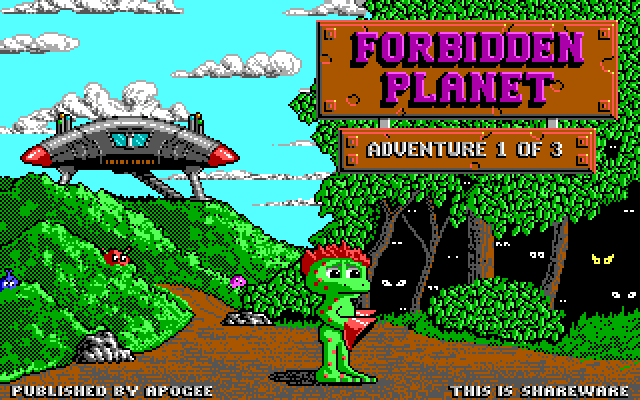
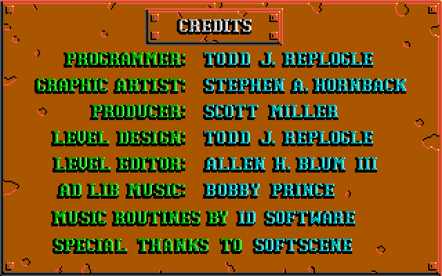
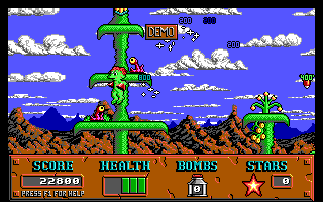
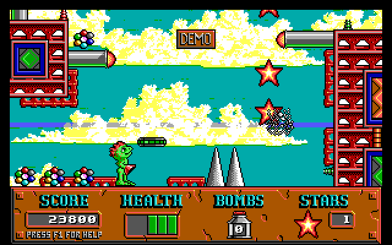

# Cosmo

A native port of **Cosmo's Cosmic Adventure: Forbidden Planet** (Apogee
Software, 1992) to modern systems. No DOS emulator.

The starting point is the original game's own code, not a reimplementation.
This project builds on [Cosmore](https://github.com/smitelli/cosmore) — Scott
Smitelli's reconstruction of the v1.20 source, recovered by disassembling the
1992 executables and accurate to 96.3% of their bytes — and replaces only the
layer that talked to PC hardware.

Everything above that layer is the game as Todd Replogle wrote it: the physics,
the actors, the collision handling, the bugs.

## Screenshots

| | |
|:-:|:-:|
|  |  |
|  |  |

All four are produced by this port, on macOS, from the original 1992 data
files — not captured from an emulator. The bottom two are the game actually
running its attract-mode demo.

## Status

| Subsystem | State |
|---|---|
| Game sources compiling on arm64 / x86_64 | ✅ 14,600 lines, zero errors |
| Emulated EGA (write modes, latches, bit mask, map mask, set/reset) | ✅ unit tested |
| Planar decode, palette, SDL3 presentation | ✅ unit tested |
| STN/VOL group files, memory, Borland runtime | ✅ |
| Interrupt and timing layer (int 8 / int 9, PIT, PIC) | ✅ 140 Hz, verified |
| **The game boots and reaches its title screen** | ✅ |
| Map loading, scrolling, actors, the attract-mode demo | ✅ |
| Keyboard, including jump while moving | ✅ verified by script |
| PC speaker sound effects | ✅ verified against the game's sound data |
| AdLib (OPL2) music, via ymfm | ✅ |
| Joystick | ⬜ |

The game runs. `cosmo` starts the original `InnerMain()` on its own thread, the
main thread plays the part of the PC hardware, and it goes through its title
screen, credits and playable attract-mode demo at the 10.8 frames per second
the original was paced for.

## Building

Requires CMake 3.21+, a C11 and C++17 compiler, and SDL3. If SDL3 is not
installed, CMake downloads and builds it automatically. The only C++ in the
project is the wrapper around ymfm, which synthesises the AdLib's YM3812.

```bash
git clone --recurse-submodules https://github.com/digows/cosmos.git
cd cosmos
cmake --preset default
cmake --build --preset default
ctest --preset default
```

**macOS** — `brew install cmake sdl3`
**Linux** — SDL3 from your distribution, or let CMake fetch it
**Windows** — vcpkg, or let CMake fetch it

For a universal binary on macOS (builds SDL from source for both slices, since
the Homebrew package is single-architecture):

```bash
cmake --preset macos-universal && cmake --build --preset macos-universal
```

## Game data

The assets belong to Apogee Software and are **not** in this repository. Put
`COSMO1.STN` and `COSMO1.VOL` in `gamedata/` — see
[gamedata/README.md](gamedata/README.md) for where to get them legally.

## Running

```bash
cd gamedata && ../build/default/cosmo
```

Runs the game. Leave it alone for a minute and it will play its attract-mode
demo.

```bash
./build/default/imgview
```

Opens a window and browses the game's fullscreen images. Arrows or space change
image, `S` saves a screenshot, `Q` or Escape quits.

```bash
./build/default/imgview gamedata TITLE1.MNI shot.png 2   # headless screenshot
```

`imgview` is a harness for the video layer alone, useful for inspecting the
fullscreen images without starting the game.

Two environment variables help with debugging and automated comparison:
`COSMO_DEBUG=1` reports the timer rate and interrupt delivery once a second,
and `COSMO_SHOT_PATH=prefix COSMO_SHOT_MS=500,3000` writes screenshots at fixed
moments after startup. `F12` takes one at any time.

## Controls

Arrow keys move, **Space** jumps, **Alt** throws a bomb.

The original shipped ctrl for jump, which was ordinary in 1992; space has been
the platformer convention for a long time since, and it is also the binding no
window manager fights over. That is the one deliberate change this port makes
to the game's behaviour — see [patches/0007](patches/). Bomb is unchanged.

All six can be rebound from the game's own menu: **G** for Game Redefine at the
main menu, then **K** for Keyboard redefine. The choice is written to
`COSMO1.CFG` alongside the sound settings and high scores, so it survives
between runs — but only on a clean exit. Quit through the game (**Q**, then
**Y**) rather than closing the window, exactly as on DOS, where killing the
program lost the file the same way.

On macOS, Command reports as Control. That matters if you rebind jump back to
ctrl: macOS binds Control with every arrow key to Mission Control, so ctrl and
a direction — jump while moving — never reaches the application at all.
Command is not claimed, and fills that gap.

## Testing without a keyboard

`COSMO_SCRIPT` points at a file of timed key events, which drives the game
without anyone at the keyboard. Together with `COSMO_SHOT_MS` it reproduces a
bug or checks a behaviour in one run:

```bash
COSMO_SCRIPT=../tests/scripts/jump-while-walking.txt \
COSMO_DEBUG=1 ../build/default/cosmo
```

Each line is `<milliseconds> <down|up|tap> <key>`. `COSMO_DEBUG=1` reports the
timer rate, interrupt delivery, and the game's own key and command state once a
second, which is how the jump-while-walking behaviour above was confirmed to
work at the emulation level before being traced to the window system.

`COSMO_AUDIO_WAV=out.wav` records everything the speaker produces. The header
is kept up to date as it goes, so the file is valid even when the game is
killed rather than quit — which is how most interesting captures end. This is
how the sound effects were checked: the capture's frequencies were compared
against the divisors decoded straight out of `SOUNDS.MNI`.

`COSMO_OPL_LOG=1` traces every write to the AdLib's registers, which is how the
music was found to be delivering all of its events to register zero.

## How it works

The main thread plays the part of the PC hardware and a second thread plays the
part of the CPU. Cosmo's main loop never yields: it busy-waits on a counter its
own timer interrupt increments, and reads keyboard state its own keyboard
interrupt fills in. On real hardware those handlers fired underneath the running
program, so here the main thread fires them at whatever rate the game programmed
into the PIT -- 140 Hz -- while the game runs uninterrupted alongside.

The original game programs the EGA through I/O ports and writes into video
memory at segment 0xA000. Rather than rewriting the drawing code, this port
emulates the adapter: four 64 KiB planes in ordinary memory, with the write
modes, latches, bit mask and set/reset logic the game depends on.

That fidelity matters. `DrawSolidTile` blits scenery from video memory to video
memory using `*dst = *src` under write mode 1, where the CPU data is discarded
and what reaches the screen is the latch content the read loaded. An EGA that
looks correct but skips the latches renders garbage.

Assembly is avoided entirely. Upstream publishes a pure C implementation of
every drawing routine in `C-DRAWING.md`, written as a curiosity because it is
too slow for a 286. On a modern CPU that cost is irrelevant, and using it
removes the dependency on Turbo Assembler, which Borland never released for
free.

## Layout

```
vendor/cosmore/    upstream submodule, pinned and never modified
vendor/ymfm/       YM3812 synthesiser, pinned and never modified
cmake/             source preparation, run at configure time
patches/           changes to upstream, one numbered patch each
include/cosmo/     platform layer headers
src/platform/      emulated EGA, video, PNG writer, DOS runtime, hardware
tools/             validation harnesses
tests/             unit tests and input scripts
```

Source preparation applies three mechanical transformations to upstream: it
drops the `#include` lines for Borland headers with no modern equivalent,
comments out the 16-bit inline assembly, and pins the base types to their
original widths — `unsigned int` was 16 bits on DOS and the game leans on the
wraparound. Anything those cannot express is a numbered patch under `patches/`,
each with a preamble explaining the defect and why the change is correct.

It all runs in CMake rather than a shell script, so it behaves the same on
every platform, and each patch is fingerprinted before and after: a patch that
reports success while changing nothing fails the configure step rather than
silently doing nothing.

## License

Code in this repository: MIT, see [LICENSE](LICENSE).

Cosmore: MIT, © Scott Smitelli and contributors.

*Cosmo's Cosmic Adventure*, its assets and trademarks: © 1992 Apogee Software,
Ltd. See [ATTRIBUTION.md](ATTRIBUTION.md).
