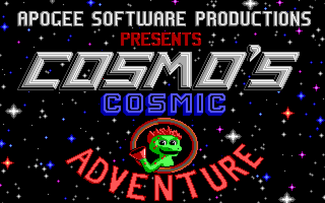

# Cosmo

A native port of **Cosmo's Cosmic Adventure: Forbidden Planet** (Apogee
Software, 1992) to modern systems. No DOS emulator.

The starting point is the original game's own code, not a reimplementation.
This project builds on [Cosmore](https://github.com/smitelli/cosmore) — Scott
Smitelli's reconstruction of the v1.20 source, recovered by disassembling the
1992 executables and accurate to 96.3% of their bytes — and replaces only the
layer that talked to PC hardware.

Everything above that layer is the game as Todd Replogle wrote it: the physics,
the actors, the collision handling, the bugs.

## Screenshots

| | |
|:-:|:-:|
|  |  |
|  |  |

These are produced by this port, on macOS, from the original 1992 data files —
not captured from an emulator. Reproduce them with:

```bash
./build/default/imgview gamedata TITLE1.MNI docs/screenshots/title1.png 2
```

They are the fullscreen images, which is what the video layer renders today.
Gameplay needs the timing and input layers that are still missing; those
screenshots will land here when they are real. The artwork is from the freely
redistributable shareware episode.

## Status

| Subsystem | State |
|---|---|
| Game sources compiling on arm64 / x86_64 | ✅ 14,600 lines, zero errors |
| Emulated EGA (write modes, latches, bit mask, map mask, set/reset) | ✅ unit tested |
| Planar decode, palette, SDL3 presentation | ✅ verified against original assets |
| STN/VOL group file reading | ✅ in the harness |
| Interrupt and timing layer (int 8 / int 9) | ⬜ |
| Keyboard and joystick | ⬜ |
| AdLib (OPL2) and PC speaker | ⬜ |
| Full game wiring | ⬜ |

The `imgview` harness already renders the game's fullscreen images straight
from the original data files, exercising the whole path: group file → four EGA
planes → palette → pixels.

## Building

Requires CMake 3.21+, a C11 compiler, and SDL3. If SDL3 is not installed, CMake
downloads and builds it automatically.

```bash
git clone --recurse-submodules https://github.com/digows/cosmos.git
cd cosmos
cmake --preset default
cmake --build --preset default
ctest --preset default
```

**macOS** — `brew install cmake sdl3`
**Linux** — SDL3 from your distribution, or let CMake fetch it
**Windows** — vcpkg, or let CMake fetch it

For a universal binary on macOS (builds SDL from source for both slices, since
the Homebrew package is single-architecture):

```bash
cmake --preset macos-universal && cmake --build --preset macos-universal
```

## Game data

The assets belong to Apogee Software and are **not** in this repository. Put
`COSMO1.STN` and `COSMO1.VOL` in `gamedata/` — see
[gamedata/README.md](gamedata/README.md) for where to get them legally.

## Running

```bash
./build/default/imgview
```

Opens a window and browses the game's fullscreen images. Arrows or space change
image, `S` saves a screenshot, `Q` or Escape quits.

```bash
./build/default/imgview gamedata TITLE1.MNI shot.png 2   # headless screenshot
```

This is a harness for the video layer, not the game — the interrupt, timing and
input layers still have to land before Cosmo himself moves.

## How it works

The original game programs the EGA through I/O ports and writes into video
memory at segment 0xA000. Rather than rewriting the drawing code, this port
emulates the adapter: four 64 KiB planes in ordinary memory, with the write
modes, latches, bit mask and set/reset logic the game depends on.

That fidelity matters. `DrawSolidTile` blits scenery from video memory to video
memory using `*dst = *src` under write mode 1, where the CPU data is discarded
and what reaches the screen is the latch content the read loaded. An EGA that
looks correct but skips the latches renders garbage.

Assembly is avoided entirely. Upstream publishes a pure C implementation of
every drawing routine in `C-DRAWING.md`, written as a curiosity because it is
too slow for a 286. On a modern CPU that cost is irrelevant, and using it
removes the dependency on Turbo Assembler, which Borland never released for
free.

## Layout

```
vendor/cosmore/    upstream submodule, pinned and never modified
cmake/             source preparation, run at configure time
include/cosmo/     platform layer headers
src/platform/      emulated EGA, video, PNG writer
tools/             validation harnesses
tests/             unit tests, no game data required
```

Source preparation applies exactly two transformations to upstream: it drops
the `#include` lines for Borland headers with no modern equivalent, and
comments out the 16-bit inline assembly. It runs in CMake rather than a shell
script so it behaves the same on every platform, and the diff against the
original stays auditable.

## License

Code in this repository: MIT, see [LICENSE](LICENSE).

Cosmore: MIT, © Scott Smitelli and contributors.

*Cosmo's Cosmic Adventure*, its assets and trademarks: © 1992 Apogee Software,
Ltd. See [ATTRIBUTION.md](ATTRIBUTION.md).
